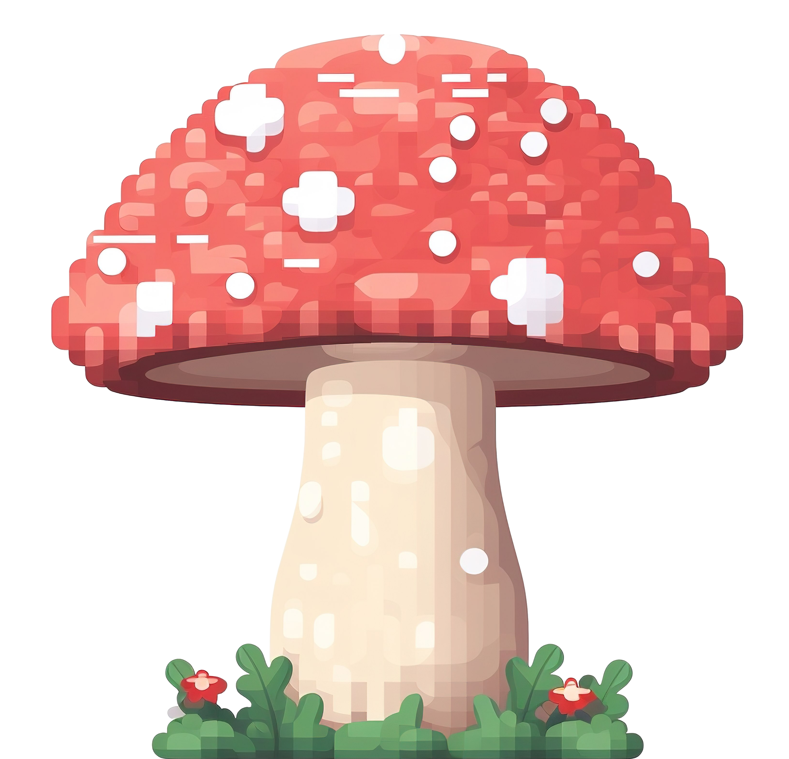

# HackShrooms Mushroom Masher! 🍄🍄‍🟫

Help **grow** mushrooms (and stop them from **shrinking**) and collect points in this **Mushroom Masher**! Gain 
points and upgrade your mushroom farm, get new skins, and more!



## Project Structure 🍄

- `index.html` - Main HTML file with Bootstrap and responsive layout
- `styles.css` - Custom CSS styles
- `script.js` - JavaScript for interactivity

## We are deployed!

Come check us out at https://hackshrooms.fly.dev/


### Running the Project

Run the game using a flask app. Run:

```bash
python3 app.py
```
Thats it! Open `(http://127.0.0.1:5000)` in your browser.

Any changes to the files will automatically reflect in the browser upon refresh.

#### Auto-Reload

To enable auto-reloading during development, you can use Flasks debug mode

```flask --app app run --debug```

## Technologies Used

- HTML5
- CSS3
- JavaScript (Vanilla)
- [Bootstrap 5](https://getbootstrap.com/)
- Python
    - Flask
